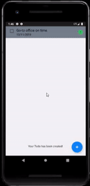

# My-Todo
This app can create todo list for the users, priotize, modify and delete them.

**Features**
1. It is a free app.
2. Ads free.
3. User friendly.
4. Add, Modify and remove todo items.
5. Can priotize todo items.

**Framework Used**
Model–view–viewmodel (MVVM) is a software architectural pattern. MVVM facilitates a separation of development of the graphical user interface – be it via a markup language or GUI code – from development of the business logic or back-end logic (the data model).

**Used Components**
1. MVVM framework
2. Adapters
3. Fragments
4. View Pagers

**GIFs**
1. Opening the app.

2. Adding todo.

3. Updating todo.

4. Deleting todo.

**Prerequisties**
1. Android Studio (IDE)
2. Android SDK

**Libraries Used**
1. LiveData
2. ViewModel
3. Room

**License**
Copyright 2019 Amit_Rai_77209979. The British College.

